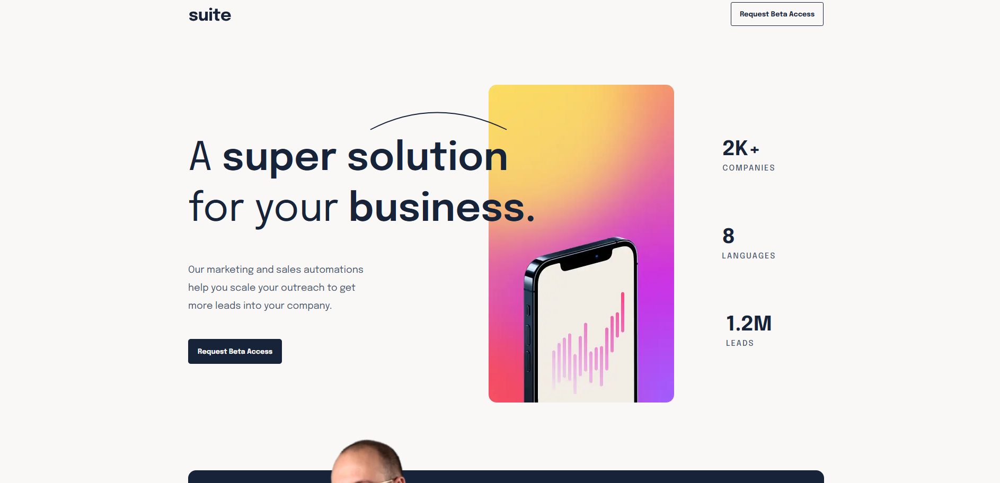

# Frontend Mentor - Suite landing page solution

### Screenshot



### Links

- Live Site URL: [Add live site URL here](https://suite-alpha.vercel.app/)

### Built with

- Semantic HTML5 markup
- CSS custom properties
- Flexbox
- CSS Grid
- Position
- Desktop-first workflow
- SASS

### What I learned

I've inlcuded several code snippets below, 
predominately things which I've done for the 
first time. 

**Explicit height/width on img element**

Using the picture element, while explicitly stating the 
height and width in the image element (that is within the picture 
element.)
```html
        
```

**Overlap with negative margins and z-index**

Using a mixture of negative margins and z-index
to get one part of a grid-container (text based)
to overlap another (image-based).
```css
.alpha__hero__one {
    display: flex;
    flex-direction: column;
    gap: calc(0.625rem + 2vw);
    grid-area: one;
    z-index: 1;
    margin-right: calc(-6.25rem - 3vw);
    padding-top: calc(0.625rem + 2vw);
}
```


## Author

- Website - [Add your name here](https://www.your-site.com)
- Frontend Mentor - [@dboca93](https://www.frontendmentor.io/profile/dboca93)
- Twitter - [@Dilan Boca](https://www.linkedin.com/in/dilan-boca-a3892294/)

